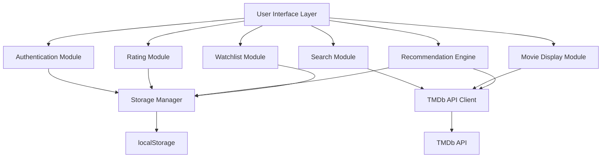

# Design Document: Movie Recommendation System

## Overview

The Movie Recommendation System is a client-side web application built with HTML, CSS, and JavaScript that provides personalized movie recommendations. The system uses a content-based filtering approach to suggest movies based on user preferences, ratings, and viewing history.

### Architecture Philosophy

This design follows a static web application architecture where all logic runs in the browser. Data persistence is achieved through localStorage, making the application deployable to any static hosting service (GitHub Pages, Netlify, Vercel) without requiring a backend server.

### Key Design Decisions

1. **Client-Side Architecture**: All application logic runs in the browser, eliminating the need for server infrastructure
2. **localStorage for Persistence**: User data, ratings, and preferences are stored locally in the browser
3. **TMDb API Integration**: Movie data is fetched from The Movie Database (TMDb) API for comprehensive movie information
4. **Content-Based Filtering**: Recommendations are generated by analyzing genre, cast, and metadata similarity
5. **Responsive Design**: Mobile-first approach ensuring the application works across all device sizes

## Architecture

### System Components



### Component Responsibilities

**User Interface Layer**
- Renders all HTML pages (login.html, home.html, movie-details.html, watchlist.html)
- Handles user interactions and events
- Manages page navigation and state transitions
- Provides visual feedback for user actions

**Authentication Module**
- Validates user credentials against stored user data
- Creates and manages user sessions
- Handles user registration and login flows
- Maintains session state using sessionStorage

**Search Module**
- Interfaces with TMDb API for movie searches
- Implements search by name, actor, genre, year, and language
- Provides case-insensitive search functionality
- Caches search results for performance

**Movie Display Module**
- Fetches movie details from TMDb API
- Renders movie cards and detail pages
- Displays posters, ratings, cast, and descriptions
- Handles image loading and error states

**Rating Module**
- Manages user ratings (1-10 scale)
- Stores ratings in localStorage
- Calculates and displays average ratings
- Handles rating updates and deletions

**Recommendation Engine**
- Implements content-based filtering algorithm
- Analyzes user rating history and preferences
- Calculates similarity scores based on genre, cast, and metadata
- Generates personalized movie recommendations

**Watchlist Module**
- Manages user's saved movies
- Provides add/remove functionality
- Displays watchlist with movie details
- Indicates watchlist status on movie pages

**Storage Manager**
- Abstracts localStorage operations
- Manages data serialization/deserialization
- Handles data migrations and versioning
- Provides error handling for storage operations

**TMDb API Client**
- Handles all API requests to TMDb
- Manages API key and authentication
- Implements rate limiting and error handling
- Caches API responses

## Components and Interfaces

### HTML Pages

#### login.html
Entry point for the application with authentication interface.

**Elements:**
- Login form (username/email + password)
- Registration form (username, email, password, confirm password)
- Form validation and error messages
- Toggle between login and registration views

#### home.html
Main dashboard displaying personalized recommendations and search interface.

**Elements:**
- Navigation bar with user menu
- Search bar with filter options
- Personalized recommendations section
- Genre filter buttons
- Movie grid display

#### movie-details.html
Detailed view of a single movie with rating and review functionality.

**Elements:**
- Movie poster and backdrop
- Title, year, genre, runtime
- Cast and crew information
- Average rating and user rating interface
- Review section with add/edit functionality
- Add to watchlist button
- Similar movies section

#### watchlist.html
User's saved movies for future viewing.

**Elements:**
- Navigation bar
- Watchlist movie grid
- Remove from watchlist functionality
- Empty state message

### JavaScript Modules

#### auth.js
```javascript
class AuthenticationService {
  login(identifier, password)
  register(username, email, password)
  logout()
  getCurrentUser()
  isAuthenticated()
  validateCredentials(identifier, password)
  createSession(user)
  destroySession()
}
```

#### storage.js
```javascript
class StorageManager {
  saveUser(user)
  getUser(identifier)
  getAllUsers()
  saveRating(userId, movieId, rating)
  getRating(userId, movieId)
  getUserRatings(userId)
  saveReview(userId, movieId, review)
  getReview(userId, movieId)
  getMovieReviews(movieId)
  savePreferences(userId, preferences)
  getPreferences(userId)
  addToWatchlist(userId, movieId)
  removeFromWatchlist(userId, movieId)
  getWatchlist(userId)
  isInWatchlist(userId, movieId)
}
```

#### tmdb-api.js
```javascript
class TMDbAPIClient {
  searchMoviesByName(query)
  searchMoviesByActor(actorName)
  searchMoviesByGenre(genreId)
  searchMoviesByYear(year)
  searchMoviesByLanguage(language)
  getMovieDetails(movieId)
  getMovieCredits(movieId)
  getSimilarMovies(movieId)
  discoverMovies(filters)
}
```

#### search.js
```javascript
class SearchEngine {
  search(query, filters)
  searchByName(name)
  searchByActor(actor)
  searchByGenre(genre)
  searchByYear(year)
  searchByLanguage(language)
  applyFilters(movies, filters)
}
```

#### recommendations.js
```javascript
class RecommendationEngine {
  generateRecommendations(userId, count)
  calculateSimilarityScore(movie1, movie2)
  analyzeUserPreferences(userId)
  getGenreBasedRecommendations(userId)
  getCastBasedRecommendations(userId)
  rankRecommendations(movies, userProfile)
}
```

#### ratings.js
```javascript
class RatingSystem {
  submitRating(userId, movieId, rating)
  updateRating(userId, movieId, newRating)
  getRating(userId, movieId)
  getAverageRating(movieId)
  submitReview(userId, movieId, reviewText)
  updateReview(userId, movieId, reviewText)
  getReviews(movieId)
}
```

#### watchlist.js
```javascript
class WatchlistManager {
  addMovie(userId, movieId)
  removeMovie(userId, movieId)
  getWatchlist(userId)
  isInWatchlist(userId, movieId)
  getWatchlistWithDetails(userId)
}
```

#### ui.js
```javascript
class UIManager {
  renderMovieCard(movie)
  renderMovieGrid(movies)
  renderMovieDetails(movie)
  showLoading()
  hideLoading()
  showError(message)
  showSuccess(message)
  updateNavigation()
}
```

### Data Models

#### User
```javascript
{
  id: string,              // UUID
  username: string,
  email: string,
  passwordHash: string,    // Hashed password
  createdAt: timestamp,
  preferences: {
    languages: string[],   // e.g., ["en", "es"]
    genres: number[]       // TMDb genre IDs
  }
}
```

#### Rating
```javascript
{
  userId: string,
  movieId: number,         // TMDb movie ID
  rating: number,          // 1-10
  timestamp: timestamp
}
```

#### Review
```javascript
{
  id: string,              // UUID
  userId: string,
  movieId: number,
  username: string,
  reviewText: string,      // Max 2000 characters
  timestamp: timestamp
}
```

#### Watchlist Entry
```javascript
{
  userId: string,
  movieId: number,
  addedAt: timestamp
}
```

#### Movie (from TMDb API)
```javascript
{
  id: number,
  title: string,
  overview: string,
  poster_path: string,
  backdrop_path: string,
  release_date: string,
  genre_ids: number[],
  vote_average: number,
  vote_count: number,
  original_language: string
}
```

#### Movie Details (extended)
```javascript
{
  ...Movie,
  runtime: number,
  genres: Array<{id: number, name: string}>,
  credits: {
    cast: Array<{
      id: number,
      name: string,
      character: string,
      profile_path: string
    }>
  }
}
```

### localStorage Schema

```javascript
{
  "users": {
    "[userId]": User
  },
  "ratings": {
    "[userId]": {
      "[movieId]": Rating
    }
  },
  "reviews": {
    "[movieId]": Review[]
  },
  "watchlists": {
    "[userId]": number[]  // Array of movie IDs
  },
  "currentSession": {
    userId: string,
    loginTime: timestamp
  }
}
```

## Data Models

### Storage Structure

The application uses a hierarchical localStorage structure to organize user data, ratings, reviews, and watchlists. Each data type is stored under a namespaced key to prevent collisions and enable efficient querying.

### Data Relationships

- Users have one-to-many relationships with Ratings, Reviews, and Watchlist entries
- Movies (identified by TMDb ID) have many-to-many relationships with Users through Ratings and Reviews
- Preferences are embedded within User objects for atomic updates
- Session data is stored separately in sessionStorage for security

### Data Validation

All data written to localStorage must be validated:
- User emails must match email regex pattern
- Passwords must be at least 8 characters
- Ratings must be integers between 1-10
- Reviews must not exceed 2000 characters
- Movie IDs must be positive integers


## Correctness Properties

*A property is a characteristic or behavior that should hold true across all valid executions of a system—essentially, a formal statement about what the system should do. Properties serve as the bridge between human-readable specifications and machine-verifiable correctness guarantees.*

### Property 1: Username or Email Login Acceptance

*For any* valid username or email string, the authentication service should accept it as a login identifier without validation errors.

**Validates: Requirements 1.1**

### Property 2: Valid Credentials Create Session

*For any* registered user with valid credentials, when those credentials are provided to the login function, a user session should be created and the user should be authenticated.

**Validates: Requirements 1.3**

### Property 3: Invalid Credentials Return Error

*For any* invalid credential combination (non-existent user, wrong password, or malformed input), the authentication service should return an authentication error and not create a session.

**Validates: Requirements 1.4**

### Property 4: Session Persistence

*For any* authenticated user session, subsequent authentication checks should continue to return authenticated status until the session is explicitly destroyed.

**Validates: Requirements 1.5**

### Property 5: Language Preference Round-Trip

*For any* valid language preference selection, storing the preference and then retrieving it should return the same language values.

**Validates: Requirements 2.2, 2.3**

### Property 6: Genre Preference Round-Trip

*For any* valid genre preference selection, storing the preferences and then retrieving them should return the same genre values.

**Validates: Requirements 2.4, 2.5**

### Property 7: Movie Name Search Returns Matching Results

*For any* movie name search query, all returned results should have titles that contain the search term (case-insensitive).

**Validates: Requirements 3.1**

### Property 8: Search Case Insensitivity

*For any* search query string, searching with different case variations (uppercase, lowercase, mixed case) should return the same set of results.

**Validates: Requirements 3.2, 4.2**

### Property 9: Actor Search Returns Movies With Actor

*For any* actor name search query, all returned movies should include that actor in their cast list.

**Validates: Requirements 4.1**

### Property 10: Genre Filter Returns Only Matching Movies

*For any* genre selection, all returned movies should be tagged with that genre.

**Validates: Requirements 5.1, 8.8**

### Property 11: Year Search Returns Movies From Year

*For any* valid year value, all returned movies should have a release year matching the search year.

**Validates: Requirements 6.1**

### Property 12: Year Validation Boundaries

*For any* year value between 1900 and the current year (inclusive), the search engine should accept it as valid; for any year outside this range, it should reject it with a validation error.

**Validates: Requirements 6.2, 6.3**

### Property 13: Language Filter Returns Only Matching Movies

*For any* language selection, all returned movies should be available in that language.

**Validates: Requirements 7.1**

### Property 14: Movie Details Display Completeness

*For any* movie, when rendered on the details page, the display should include all required fields: poster, release year, genre, average rating, description, and cast information.

**Validates: Requirements 9.1, 9.2, 9.3, 9.4, 9.5, 9.6**

### Property 15: Authenticated Users Can Submit Ratings

*For any* authenticated user and any movie, the rating system should allow the user to submit a rating value.

**Validates: Requirements 10.1**

### Property 16: Rating Value Validation

*For any* rating submission, the system should accept values between 1 and 10 (inclusive) and reject values outside this range.

**Validates: Requirements 10.2**

### Property 17: Rating Storage Round-Trip

*For any* user rating submission, storing the rating and then retrieving it should return the same rating value associated with the same user and movie.

**Validates: Requirements 10.3**

### Property 18: Rating Update Capability

*For any* movie that a user has already rated, submitting a new rating should replace the old rating, and retrieving the rating should return the updated value.

**Validates: Requirements 10.4**

### Property 19: Average Rating Calculation

*For any* movie with multiple user ratings, the displayed average rating should equal the arithmetic mean of all submitted ratings for that movie.

**Validates: Requirements 10.5**

### Property 20: Authenticated Users Can Submit Reviews

*For any* authenticated user and any movie, the rating system should allow the user to submit a text review.

**Validates: Requirements 11.1**

### Property 21: Review Length Validation

*For any* review submission, the system should accept reviews up to 2000 characters and reject reviews exceeding this length.

**Validates: Requirements 11.2**

### Property 22: Review Storage Round-Trip

*For any* user review submission, storing the review and then retrieving it should return the same review text associated with the same user and movie.

**Validates: Requirements 11.3**

### Property 23: Reviews Display on Details Page

*For any* movie with submitted reviews, the movie details page should display all reviews associated with that movie.

**Validates: Requirements 11.4**

### Property 24: Review Update Capability

*For any* movie that a user has already reviewed, submitting a new review should replace the old review, and retrieving the review should return the updated text.

**Validates: Requirements 11.5**

### Property 25: Recommendations Generated With Rating History

*For any* user who has rated at least one movie, the recommendation engine should generate and return a non-empty list of movie recommendations.

**Validates: Requirements 12.1**

### Property 26: Recommendation Similarity

*For any* user's recommended movies, each recommendation should share at least one genre or cast member with the user's highly-rated movies (rating >= 7).

**Validates: Requirements 12.3**

### Property 27: Minimum Recommendation Count

*For any* user with sufficient rating history (at least 3 rated movies), the recommendation engine should return at least 5 recommendations.

**Validates: Requirements 12.4**

### Property 28: Recommendation Ordering by Similarity

*For any* list of recommendations, the movies should be ordered by descending similarity score, with the most similar movies appearing first.

**Validates: Requirements 12.5**

### Property 29: Recommendations Update With New Ratings

*For any* user, when a new movie rating is added, the generated recommendations should be different from the recommendations before the rating was added (assuming the new rating provides new preference information).

**Validates: Requirements 12.6**

### Property 30: Home Page Recommendation Count

*For any* authenticated user with sufficient data, the home page should display at least 10 personalized recommendations.

**Validates: Requirements 13.4**

### Property 31: Authenticated Users Can Add to Watchlist

*For any* authenticated user and any movie, the system should allow the user to add the movie to their watchlist.

**Validates: Requirements 14.1**

### Property 32: Watchlist Storage Round-Trip

*For any* movie added to a user's watchlist, retrieving the user's watchlist should include that movie.

**Validates: Requirements 14.2**

### Property 33: Watchlist Removal

*For any* movie in a user's watchlist, when the movie is removed, retrieving the watchlist should no longer include that movie.

**Validates: Requirements 14.4**

### Property 34: Watchlist Status Indication

*For any* movie in a user's watchlist, when viewing that movie's details page, the page should indicate that the movie is saved to the watchlist.

**Validates: Requirements 14.5**


## Error Handling

### Error Categories

**Authentication Errors**
- Invalid credentials (wrong username/password)
- User already exists (during registration)
- Session expired
- Unauthenticated access attempts

**Validation Errors**
- Invalid email format
- Password too short (< 8 characters)
- Rating out of range (not 1-10)
- Review too long (> 2000 characters)
- Invalid year (< 1900 or > current year)

**API Errors**
- TMDb API rate limit exceeded
- Network connection failure
- Invalid API response
- Movie not found (404)
- API key invalid or expired

**Storage Errors**
- localStorage quota exceeded
- localStorage not available (private browsing)
- Data corruption or invalid JSON
- Missing required data

### Error Handling Strategy

**User-Facing Errors**
All errors should be displayed to users with:
- Clear, non-technical error messages
- Suggested actions to resolve the issue
- Visual feedback (error styling, icons)
- Dismissible error notifications

**API Error Handling**
- Implement exponential backoff for rate limiting
- Cache API responses to reduce requests
- Provide fallback UI for network failures
- Display "offline mode" indicator when API is unavailable

**Storage Error Handling**
- Check localStorage availability on app initialization
- Implement graceful degradation if storage is unavailable
- Provide data export functionality before quota is reached
- Validate all data before writing to storage

**Logging Strategy**
- Log all errors to browser console with context
- Include timestamp, user ID (if authenticated), and error stack
- Implement error boundaries for critical UI sections
- Track error frequency for debugging

### Error Recovery

**Session Recovery**
- Automatically redirect to login page on session expiration
- Preserve user's current page/state for post-login redirect
- Clear invalid session data on authentication errors

**Data Recovery**
- Implement data validation on read operations
- Provide "reset data" option for corrupted storage
- Export/import functionality for data backup

**Network Recovery**
- Retry failed API requests with exponential backoff
- Queue user actions when offline, sync when online
- Display cached data while fetching fresh data

## Testing Strategy

### Overview

The testing strategy employs a dual approach combining unit tests for specific scenarios and property-based tests for comprehensive coverage. This ensures both concrete edge cases and general correctness properties are validated.

### Unit Testing

**Framework**: Jest (JavaScript testing framework)

**Test Coverage Areas**:

1. **Authentication Module**
   - Valid login with username
   - Valid login with email
   - Invalid credentials rejection
   - Password hashing verification
   - Session creation and destruction
   - Registration with duplicate username/email

2. **Storage Manager**
   - Data serialization/deserialization
   - localStorage quota handling
   - Data migration between versions
   - Concurrent access handling

3. **Search Engine**
   - Empty search query handling
   - Special character handling in queries
   - No results found scenario
   - Multiple filter combination

4. **Recommendation Engine**
   - New user with no ratings (cold start)
   - User with single rating
   - User with all movies rated
   - Genre-only similarity
   - Cast-only similarity

5. **Rating System**
   - First rating on a movie
   - Rating update
   - Average calculation with single rating
   - Review character limit boundary (1999, 2000, 2001 chars)

6. **Watchlist Manager**
   - Add duplicate movie to watchlist
   - Remove non-existent movie from watchlist
   - Empty watchlist display

7. **UI Components**
   - Movie card rendering with missing poster
   - Movie card rendering with missing data
   - Loading state display
   - Error message display

**Unit Test Guidelines**:
- Focus on edge cases and error conditions
- Test integration points between modules
- Verify specific examples from requirements
- Keep tests focused and fast (< 100ms each)
- Use mocks for TMDb API calls

### Property-Based Testing

**Framework**: fast-check (JavaScript property-based testing library)

**Configuration**:
- Minimum 100 iterations per property test
- Seed-based reproducibility for failed tests
- Shrinking enabled for minimal failing examples

**Property Test Implementation**:

Each correctness property from the design document must be implemented as a property-based test with the following structure:

```javascript
// Example property test structure
test('Property 1: Username or Email Login Acceptance', () => {
  fc.assert(
    fc.property(
      fc.oneof(fc.emailAddress(), fc.string({ minLength: 3, maxLength: 20 })),
      (identifier) => {
        const result = authService.validateIdentifier(identifier);
        return result.isValid === true;
      }
    ),
    { numRuns: 100 }
  );
});
```

**Test Tagging**:
Each property test must include a comment tag referencing the design document:

```javascript
/**
 * Feature: movie-recommendation-system, Property 1: Username or Email Login Acceptance
 * For any valid username or email string, the authentication service should 
 * accept it as a login identifier without validation errors.
 */
```

**Generator Strategy**:

Custom generators will be created for domain objects:
- `arbUser()`: Generates random valid user objects
- `arbMovie()`: Generates random movie objects matching TMDb structure
- `arbRating()`: Generates ratings between 1-10
- `arbReview()`: Generates review text up to 2000 characters
- `arbYear()`: Generates years between 1900 and current year
- `arbGenre()`: Generates valid genre IDs
- `arbLanguage()`: Generates valid language codes

**Property Test Coverage**:

All 34 correctness properties must be implemented as property-based tests:
- Properties 1-4: Authentication
- Properties 5-6: Preferences
- Properties 7-13: Search and filtering
- Property 14: Movie details display
- Properties 15-19: Rating system
- Properties 20-24: Review system
- Properties 25-30: Recommendation engine
- Properties 31-34: Watchlist management

### Integration Testing

**Scope**: End-to-end user flows

**Test Scenarios**:
1. Complete user journey: Register → Set preferences → Search → Rate → Get recommendations
2. Watchlist flow: Login → Search → Add to watchlist → View watchlist → Remove
3. Review flow: Login → Search movie → View details → Submit review → Edit review
4. Session flow: Login → Navigate pages → Logout → Verify session cleared

**Tools**: Playwright or Cypress for browser automation

### Test Organization

```
tests/
├── unit/
│   ├── auth.test.js
│   ├── storage.test.js
│   ├── search.test.js
│   ├── recommendations.test.js
│   ├── ratings.test.js
│   ├── watchlist.test.js
│   └── ui.test.js
├── properties/
│   ├── auth.properties.test.js
│   ├── preferences.properties.test.js
│   ├── search.properties.test.js
│   ├── ratings.properties.test.js
│   ├── reviews.properties.test.js
│   ├── recommendations.properties.test.js
│   └── watchlist.properties.test.js
├── integration/
│   ├── user-journey.test.js
│   ├── watchlist-flow.test.js
│   └── review-flow.test.js
└── generators/
    └── arbitraries.js
```

### Testing Best Practices

1. **Balance**: Use unit tests for specific examples and edge cases; use property tests for general correctness
2. **Isolation**: Each test should be independent and not rely on other tests
3. **Clarity**: Test names should clearly describe what is being tested
4. **Speed**: Unit tests should run quickly; property tests may take longer due to iterations
5. **Maintainability**: Keep tests simple and avoid testing implementation details
6. **Coverage**: Aim for 80%+ code coverage, but prioritize meaningful tests over coverage metrics

### Continuous Integration

- Run all unit tests on every commit
- Run property tests on pull requests
- Run integration tests before deployment
- Generate coverage reports and track trends
- Fail builds on test failures or coverage drops

